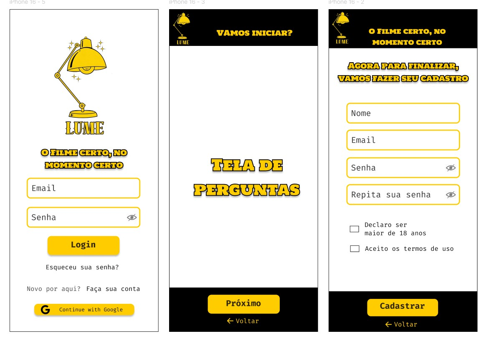
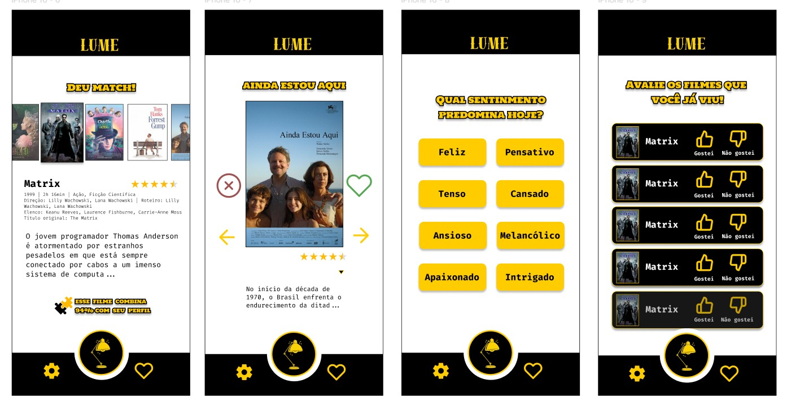
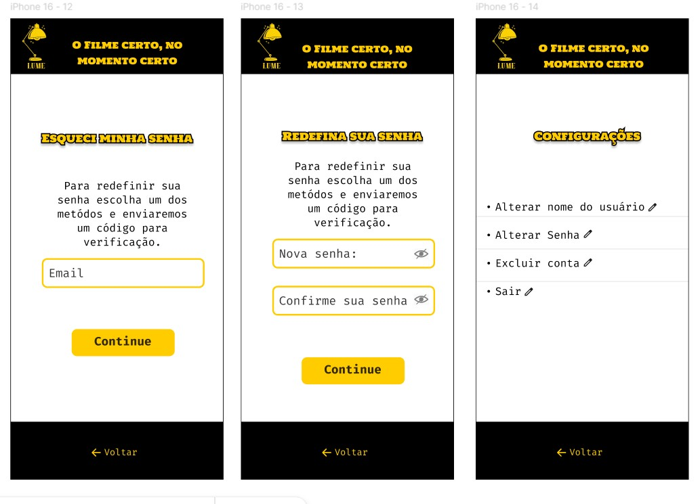

# Lume Client

Aplicação cliente do projeto Lume, responsável pela interface e interação com o usuário em um sistema de recomendação de filmes.

O nome *Lume* vem do latim e significa “luz”, fazendo referência ao cinema e à experiência de descoberta de novos conteúdos.

## Funcionalidades

- Coleta de preferências do usuário  
- Sistema interativo de escolha de filmes com **swipe**  
- Exibição de recomendações personalizadas  
- Navegação fluida entre telas  
- Experiência visual inspirada em estética de cinema clássico  

## Tecnologias

- .NET MAUI  
- C#  
- XAML  

## Ferramentas

- Visual Studio 2022  
- Git / GitHub  
- Figma  
- ClickUp  

## Estrutura do Projeto

- Interface construída com XAML  
- Lógica de interação implementada em C#  
- Organização modular para facilitar manutenção  

## Interface

A interface foi desenvolvida com foco em ser **intuitiva e imersiva**, utilizando elementos visuais inspirados no cinema antigo, reforçando a identidade do projeto.  
A interação por swipe torna a experiência dinâmica e próxima de aplicações modernas de recomendação.

## Protótipos (Figma)

As telas foram inicialmente projetadas no Figma, definindo identidade visual, fluxo de navegação e experiência do usuário.

### Telas iniciais (Login, Perguntas e Cadastro)
Conjunto com 3 telas representando o fluxo inicial do usuário.

### Telas de interação (Recomendações e Swipe)
Conjunto com 4 telas demonstrando a navegação e interação principal do app.

### Telas de configuração
Conjunto com 3 telas relacionadas a ajustes e preferências do usuário.
  

## Integração

Este projeto atua como front-end da aplicação.

## Objetivo

Desenvolver um software que auxilie na redução do impacto do paradoxo de escolha e recomende filmes, através de IA, para os usuários que utilizam a aplicação, de forma personalizada e interativa.

## Status

Projeto em desenvolvimento.

## Autor

Projeto desenvolvido em colaboração.  
Contribuições disponíveis no histórico de commits do repositório.

## Como Utilizar

Para executar a aplicação, é necessário:

- Visual Studio 2022 ou superior
- .NET MAUI instalado
- SDK do .NET compatível
- Emulador Android/iOS ou dispositivo físico

### Execução

1. Abra o projeto no Visual Studio
2. Selecione um dispositivo (emulador ou físico)
3. Execute a aplicação (F5)

